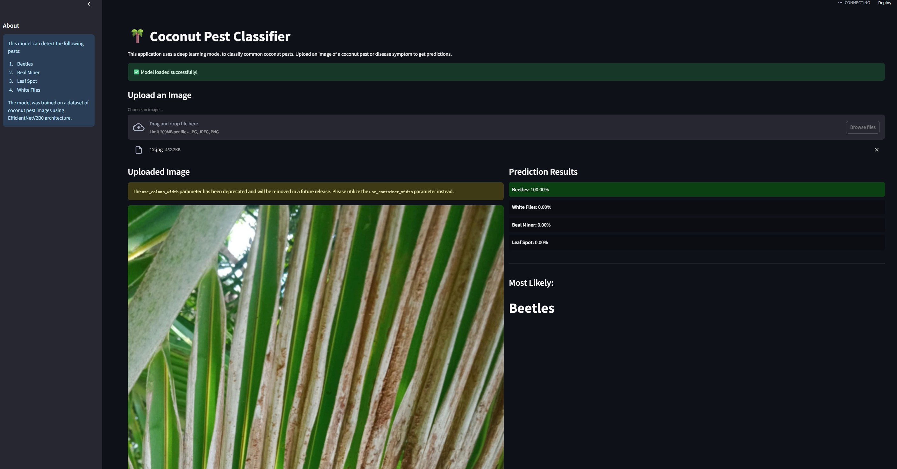

# Coconut Pest Classification System

A deep learning system for classifying common coconut pests using EfficientNetV2B0. The system can identify four types of pests with high accuracy.

## Features

- 🔍 Identifies 4 types of coconut pests:
  - Beetles
  - Leaf Miner
  - Leaf Spot
  - White Flies
- 🎯 High accuracy model
- 🖥️ Multiple interfaces:
  - Command-line tool
  - Web interface (Streamlit)
- 🚀 Fast inference
- 📊 Confidence scores for predictions

## Dataset Organization

### Training Set (80%): 473 images
- Beetles: 92 images
- Leaf Miner: 115 images
- Leaf Spot: 136 images
- White Flies: 130 images

### Validation Set (20%): 121 images
- Beetles: 24 images
- Leaf Miner: 29 images
- Leaf Spot: 35 images
- White Flies: 33 images

## Installation

### Prerequisites

- Python 3.10 or higher
- CUDA-capable GPU (optional, for faster inference)

### Basic Setup

1. Clone the repository:
```bash
git clone [repository-url]
cd coconut-pest-classifier
```

2. Create and activate a virtual environment:
```bash
# Windows
python -m venv venv
.\venv\Scripts\activate

# Linux/Mac
python -m venv venv
source venv/bin/activate
```

3. Install dependencies:
```bash
pip install -r requirements.txt
```

### GPU Support (Optional)

For GPU acceleration, you need:
1. NVIDIA GPU with CUDA support
2. CUDA Toolkit 11.8
3. cuDNN 8.6 or later

Installation steps:
1. Download and install [CUDA Toolkit 11.8](https://developer.nvidia.com/cuda-11-8-0-download-archive)
2. Download and install [cuDNN v8.6](https://developer.nvidia.com/cudnn) (requires NVIDIA account)
3. Add CUDA paths to system environment variables

## Usage

### Command Line Interface

1. Test a single image:
```bash
python test_prediction.py
```
- Follow the prompts to select an image
- View prediction results and confidence scores

### Web Interface
<p align="center">
  
</p>


1. Start the Streamlit app:
```bash
python -m streamlit run app.py
```
2. Open your browser at `http://localhost:8501`
3. Upload an image using the interface
4. View predictions and confidence scores

## Docker Deployment

### Local Development
```bash
docker-compose up --build
```

### Production Deployment
1. Configure SSL certificates
2. Update domain in nginx configuration
3. Run with production settings:
```bash
docker-compose -f docker-compose.prod.yml up --build -d
```

## Project Structure

```
coconut-pest-classifier/
├── app.py                     # Streamlit web interface
├── test_prediction.py         # Command-line testing tool
├── coconut_disease_classifier.py  # Model training script
├── requirements.txt           # Python dependencies
├── Dockerfile                # Container configuration
├── docker-compose.yml        # Docker services setup
├── nginx/                    # Nginx configuration
├── dataset/                  # Training and validation data
│   ├── train/               # Training images (80%)
│   └── validation/          # Validation images (20%)
└── model/                    # Trained model files
```

## Model Architecture

- Base: EfficientNetV2B0
- Custom classification head with residual connections
- Progressive training in three phases
- Data augmentation for training
- Class weight balancing

For detailed information about the model architecture and training process, see [readme_finetune.md](readme_finetune.md).

## License

This project is licensed under the MIT License - see the LICENSE file for details.

## Acknowledgments

- Dataset contributors
- EfficientNet authors
- TensorFlow team
